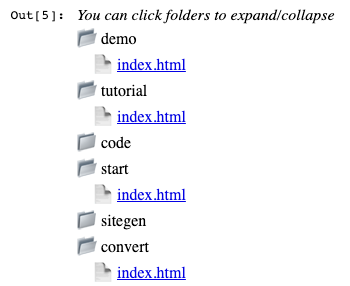

# An Improved Unix Terminal

In this demo, we're going to show how to use [**VanJS**](https://vanjs.org/) to develop a web-based Unix terminal that connects to your local computer, with some notable improvements, all under 300 lines of code. While there are numerous open source projects aiming for a better terminal or shell, this example demonstrates that, with **VanJS**, we can easily provide great extension to commandline utilities with fancy GUI by leveraging all available HTML elements.

The program is heavily tested in macOS, and should in theory works in Linux, or in any environment that has `/bin/sh`.

You can preview the terminal app via [CodeSandbox](https://codesandbox.io/p/sandbox/github/vanjs-org/van/tree/main/demo/terminal).

## Features

Compare to the ordinary Unix terminal that you're familiar with, this web-based terminal has 2 notable improvements:

1. Command `ps ...` will render an HTML table instead of text output.
2. Command `tree` (need the exact text match) will render an interactive tree-view of your current directory, like the one in the screenshot below:



## Source Files

* [`server.ts`](https://github.com/vanjs-org/van/blob/main/demo/terminal/server.ts): A Deno-based server-side script which connects to the shell of your local computer.
* [`client.html`](https://github.com/vanjs-org/van/blob/main/demo/terminal/client.html): An HTML file served by `server.ts` with client-side implementation for the GUI of the terminal.
* [`van-1.2.5.min.js`](https://github.com/vanjs-org/van/blob/main/demo/terminal/van-1.2.5.min.js): Minified **VanJS** code, used by `client.html`.

## Run the Terminal App in Your Local Computer

Follow the steps below to run the terminal app in your local computer:

1. For the terminal to work, you need Deno runtime to run the server-side script. If you don't have Deno in your environment, you can get it installed from https://deno.land/.
2. Clone the `van` repo, if you haven't done already:
```shell
git clone https://github.com/vanjs-org/van.git
```
3. Go to the root directory of the `van` repo:
```shell
cd van
```
4. Run the command below under your working directory (_You can specify the port via `--port` flag. By default, port 8000 will be chosen_):
```shell
deno run --allow-net --allow-run --allow-read demo/terminal/server.ts
```

5. You can visit the web-based shell with the URL printed in the console output of `deno run`. In your first visit, it will ask you to login, you need to paste the random key printed from the console to proceed.
6. After login, you will be able to see and use the web-based shell.

## Security Considerations

This demo program allows web access to your OS shell, which elevates the privilege to a level that you would not normally get with your browser. Here are the extra measures we're taking to ensure the security of your local computer while testing the demo:

1. Only local connection to your server is allowed, unless flag `--allowRemote` is specified.
2. Before using the web-based terminal in your browser, you need to login with the key printed in the console of `server.ts` first (unless flag `--skipLogin` is specified). The key is generated randomly every time the server restarts. You should never share the key to other people.
3. You're advised to shut down the server when you're not using the terminal to further reduce the risk of unauthorized access to your terminal with the leaked key. Next time, when the server restarts, any browser access needs the login with a new key generated randomly.
4. Please be aware that any commands you run in the web-based shell are the real commands executed on your computer. Thus don't try dangerous stuff as they are IRREVERSIBLE.

If you're considering building a usable terminal beyond demo purposes, you should pack things up in a way that is both secure and convenient.
